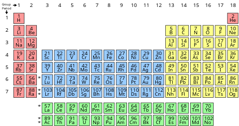

Периодическая система химических элементов (таблица Менделеева) — классификация химических элементов, устанавливающая зависимость различных свойств элементов от заряда их атомного ядра.

Система является графическим выражением периодического закона, открытого русским учёным Д. И. Менделеевым в 1869 году и установившего зависимость свойств элементов от их атомного веса (в современных терминах, от атомной массы).

Первоначальный вариант был разработан Д. И. Менделеевым в 1869 и приведён к традиционному графическому виду в 1871 году.

Всего предложено несколько сотен вариантов изображения периодической системы (аналитические кривые, таблицы, геометрические фигуры и т. п.).

В современном варианте системы предполагается сведение элементов в двумерную таблицу, в которой каждый столбец (группа) определяет основные физико-химические свойства, а строки представляют собой периоды, в определённой мере подобные друг другу.